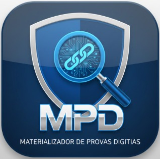

  

<h1 align="center">Materializador de Provas Digitais (MPD)</h1>

  [cite_start]<strong>Ferramenta pericial ágil desenvolvida especificamente para viabilizar a coleta, preservação e o enclausuramento de provas digitais com fundamentação jurídica sólida. [cite: 82]</strong>

  <a href="https://tircsis.github.io/mpd/">🌐 Acessar o Site Oficial e Download</a>

## 🛡️ Sobre o Projeto

O **MPD** é um software forense "Stand-Alone" focado na captura probatória de evidências em meios digitais. [cite_start]Todo o material coletado via MPD é assegurado utilizando Cadeias de Hash SHA-256 e Timestamps locais[cite: 83]. [cite_start]Isso garante a integridade (comprovando que o arquivo não foi adulterado), o não-repúdio e a conformidade com as resoluções do Superior Tribunal de Justiça (STJ) em processos penais ou administrativos[cite: 7, 83].

## ✨ Principais Funcionalidades

* [cite_start]**🔒 Cadeia de Custódia Integrada:** Sempre que um print ou vídeo for finalizado, ocorre o cálculo da Hash SHA-256 imediata do arquivo, registrando sua integridade no instante preciso em que ele foi originado da memória[cite: 122].
* [cite_start]**🚀 Portabilidade Forense:** O executável não requer instalação do software, download de bibliotecas Python ou frameworks externos[cite: 93]. [cite_start]Pode ser executado diretamente de um Pen Drive institucional ou pastas restritas, sem exigir privilégios de Administrador[cite: 94, 95].
* [cite_start]**🔌 100% Offline e Seguro:** A ferramenta funciona de maneira totalmente offline[cite: 96]. [cite_start]Não envia dados para a web: nenhuma informação dos alvos, senhas, hashes ou mídias são transmitidos a servidores em nuvem[cite: 136].
* [cite_start]**📸 Captura Híbrida:** * *Screenshot Manual:* Clica e tira uma foto exata da tela no momento[cite: 115].
  * [cite_start]*Auto Screenshot:* Tira fotos periodicamente a cada 10 segundos automaticamente[cite: 116].
  * [cite_start]*Gravar Tela (Vídeo):* Inicia a gravação de um arquivo .mp4 fluido com até 20 FPS[cite: 118].
* [cite_start]**📑 Relatório Técnico Avançado:** O MPD fará o fechamento automático e irá compor e salvar o Relatório Técnico Oficial PDF contendo: Capa, dados do alvo, carimbo de tempo, detalhamento individual de cada prova e suas hashes[cite: 126, 130].

## 🎯 Casos de Uso Comuns

* [cite_start]Registro de ofensas, ameaças ou confissões em redes sociais (WhatsApp Web, Instagram, etc)[cite: 85].
* [cite_start]Captura de anúncios ou transações financeiras ilícitas[cite: 86].
* [cite_start]Demonstração técnica de sistemas, logs ou rastreios em tempo real[cite: 87].
* [cite_start]Materialização de evidências efêmeras (que podem ser apagadas pelo autor a qualquer momento)[cite: 88].

## 💻 Como Utilizar

1. [cite_start]**Cabeçalho Institucional:** Informe o Órgão Responsável, o seu Nome (Operador) e carregue a Logo com o brasão da sua instituição[cite: 32].
2. [cite_start]**Dados da Coleta:** Preencha o "Número do Caso" e o "Alvo/Investigado"[cite: 35]. [cite_start]Clique em "Iniciar Coleta"[cite: 112].
3. [cite_start]**Capturando Evidências:** Utilize os controles de captura (Manual, Auto ou Vídeo) no rodapé do MPD[cite: 114]. [cite_start]A caixa de eventos exibirá a auditoria em tempo real[cite: 120].
4. [cite_start]**Finalização:** Clique no botão vermelho "Finalizar Coleta e Gerar Relatório"[cite: 125]. [cite_start]A ferramenta criará uma pasta lacrada nos seus Documentos nomeada com a Data, a Hora e o "Número do Caso" contendo todo o material pericial[cite: 128].

## ⚖️ Conformidade e Base Jurídica

[cite_start]A arquitetura do MPD está alinhada à **ISO/IEC 27037:2012**[cite: 55]. [cite_start]Esta é uma norma internacional essencial que estabelece diretrizes para a identificação, coleta, aquisição e preservação de evidências digitais[cite: 55]. [cite_start]O processo definido pela norma prioriza a integridade da evidência[cite: 57]. 

🌍 **Suporte Multidioma:** A ferramenta possui recursos e emite laudos nos idiomas Português, Inglês e Espanhol.

## 📥 Instalação / Download

Por ser uma ferramenta portátil, acesse a Landing Page Oficial, faça o download do executável compatível com Windows 10/11 (64-bits) e utilize imediatamente:

👉 **[Download do MPD (Página Oficial)](https://tircsis.github.io/mpd/)**

---
[cite_start]*O Software está concebido gratuitamente como prestação de serviço à excelência de investigação penal moderna[cite: 139].*
